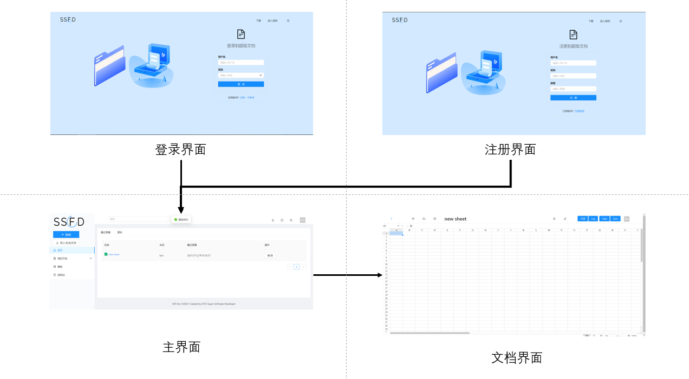
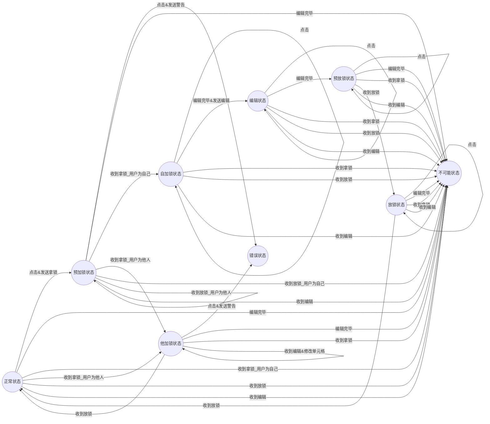
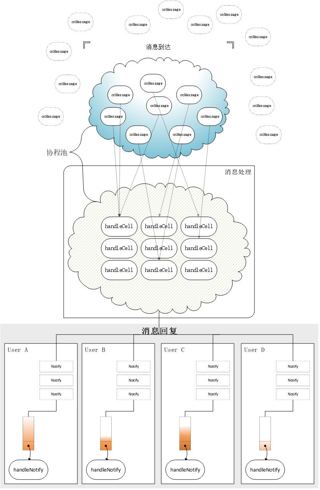

# gDocs设计报告

<p align="right">SSFD小组</p>

## 整体框架

网页前端 + 分布式后端 + DFS + ZooKeeper

## 网页前端

前端需要负责后端数据的转换渲染，以及不同用户间协同编辑时的状态同步。gDocs的网页前端主要使用React编写，部分利用了Antd的组件库，整体风格与**腾讯文档**相似，分为登录/注册界面，主界面和文档界面，操作逻辑清晰明了。Sheet部分的实现使用了LuckySheet提供的原型，但考虑到特殊的编辑需求，未使用官方提供的协同编辑功能，而是通过Hook函数和WebSocket等实现了一套自己的协同编辑逻辑。

### 技术栈

- 前端渲染

  - React

  - Antd

- 前后端通信

  - WebSocket (前端状态同步)

  - Http (自动重发)

### 总体架构

  

#### 登陆界面

- 用户可以在登陆界面输入用户名和密码或者进入网站。
- 用户可以点击链接跳转至注册界面。

#### 注册界面

- 用户可以输入用户名，密码和邮箱来注册账号从而进入网站。

#### 主页面

- 按访问时间从新到旧展示用户拥有的或者被分享的文档。

- 用户可以删除自己创建的文档。

- 用户可以在回收站中看到这些被删除的文档并选择恢复文档。

- 用户可以点击文档条目后会跳转到对应文档的编辑界面。

#### 文档界面

- 用户可以在此处编辑文档。
- 若用户希望分享文档给其它用户，可以复制当前URL，其他用户可以通过此URL加入，进行协同编辑。
- 在文档界面中可以看到文件编辑的历史记录(Log)，也可以看到文档的恢复点（Checkpoint，由系统自动保存或者用户手动保存）。
- 用户可以选择恢复到某一个恢复点，并点击恢复来保存此次恢复。
- 用户可以插入图片。
- 用户可以上传文件。

### 具体实现

#### HTTP请求自动迁移

为了实现动态扩展和高可用性，我们采用了多后端的设计。我们对于大多数和文档相关的请求，实现了自动从定向，这些请求可以被自动从定向到对应后端，实现流量的动态分配和负载均衡。对于普通的HTTP请求，我们给予了其一个时间上限（暂定10000ms），若在规定时间内，后端无响应（暗示可能服务器出现故障），则会自动切换端口重新尝试请求，此后的请求会一直沿用这个端口，直到此端口的后端出现无响应等问题。

#### 协同编辑状态机

前端实现协同编辑状态时需要同步如文档内容和锁等信息，对于某个单元格的状态，可用状态机的方式表示：

单元格状态有：正常状态，自加锁状态，他加锁状态，编辑状态，预放锁状态，放锁状态。

被动动作有：点击，编辑完毕，收到拿锁，收到放锁，收到编辑。

主动动作有：修改单元格，发送拿锁，发送放锁，发送编辑，发送警告。

整个状态转移图如下所示：



错误状态并不会停止整个前端，而是会给用户以提示信息。

当然只依靠前端是不可能在实现最优情况下的顺序一致性，对于这部分的描述详见后端文档。

## 分布式后端

后端主要负责和为前端提供数据以及将数据保存至DFS。为了实现动态扩容和高可用性，采用了多后端的设计。

### 技术栈

- 分布式缓存
  - 一致性哈希
  - ZooKeeper集群
  - 并发缓存池，LRU Eviction
  - Log & Checkpoint
  - FSCheck
  - 单点登录（JWT）
  - HTTP自动重定向

- 高吞吐WebSocket
  - 协程池
  - 消息队列
  - Lock-free

### 总体架构


#### Web服务器

后端服务器使用Go语言编写，以Iris为Web服务器框架。

##### 特点

- 高可拓展性：通过一致性哈希，服务器可动态增加删除

- 高可用性：

  - 使用Log和Checkpoint，并有详细分析过的FSCheck机制，具有较强的崩溃一致性

  - 无状态服务器，任务可迁移

- 高性能：
  - 使用基于LRU驱逐机制的缓存池，减少DFS读写
  - 使用虚拟节点的一致性哈希，负载均衡

##### 主要功能

- 响应前端请求
  - 登陆、注册
  - 文件权限管理
  - 文件版本管理
  - 文件回收站
  - Websocket实时编辑
  - 大文件上传与下载

- 与DFS交互

  - 缓存固定大小的文件
  - 持久化日志，主动或被动持久化快照

  具体请求接口详见附录A[后端接口](#backendApi)。

#### Zookeeper集群

##### 主要功能

- 服务发现

- 心跳管理

- 分布式锁

#### Mysql服务器

##### 主要功能

- 存储用户信息

- 存储回收站信息

### 具体实现

#### 服务器动态增删

##### 如何实现服务的分布式

分布式主要是通过JWT单点登录和HTTP 300状态码自动重定向完成的, 详见附录A[代码片段 1](#Acode1)。

前端随机向预设的后端发送请求，后端判断该资源是否在我这里，如果是则处理请求；否则将请求重定向到正确的后端进行处理。

所有后端共享同一私钥，使用JWT作为Token，这样用户在某个服务器上登陆后重定向到其他服务器之后原先的Token依然可以继续使用。

在这个过程中，所有后端的地位是**等价**的，即不存在专门用来提供访问接口的服务器。这样的设计主要是为了避免接口服务器单点故障导致全局故障。转发每一个都可以负责，这样任意后端的崩溃不会造成服务失效，保证系统的可用性。

##### 一致性哈希

###### ZooKeeper的心跳和服务发现功能

一致性哈希借助了ZooKeeper进行实现。

利用ZooKeeper中的*ChildrenWatch*获得当前目录下子节点名称，并注册回调事件，当子节点发生改变时触发。值得注意的是，这个注册函数是**一次性**的，也就是说每次回调函数触发时，原先注册的监听事件会被取消，于是需要重新注册。这样会带来新的问题：在回调事件**触发**和**重新注册**之间的事件会被遗漏（在GitHub上许多Go语言的ZooKeeper库都有这个问题，它们只是简单地使用for & select在新事件来的时候重新注册）。为了解决这个问题，我们利用了*ChildrenWatch*在注册和获得子节点列表上的原子性。当回调事件触发时，我们不仅仅关注触发事件的节点，而是将重新调用*ChildrenWatch*后获得的新的子节点集合和之前的集合一起进行考虑。这样旧集合和新集合差集是断开连接的服务器，新集合和就集合的差集则是新加入的服务器。详见附录A[代码片段 2](#Acode2)。

###### “一致的”一致性哈希

利用ZooKeeper提供的心跳功能，每个后端的连接或断开都能在心跳最长事件内被所有后端感知到。这样后端在收到事件时将发生变化的节点从一致性哈希算法中加入或删除，当新的资源请求到来时，所有的后端节点都能将其一致判断为同一个后端，根据是否为自己的来进行重定向。详见附录A[代码片段 3](#Acode3)。

##### 细节的问题和解决方案

###### 普通HTTP请求的迁移

对于普通的HTTP请求，如果后端崩溃，那么在给定的ZooKeeper心跳时间（我们设置成7s）有些请求还是会被重定向到这个崩溃的服务器，导致短暂的不可用。因为HTTP请求是短连接，这个问题只要过一会就会自动解决。

###### WebSocket长连接的迁移

然而，因为WebSocket需要后端和前端建立长连接，如果之前的用户都连接在一个后端上，此时新增了一个后端，一致性哈希判断这个资源应该由新加入的后端负责；此时有新的用户加入了这个文件的实时编辑，他会连接到新的后端上。这样会导致一个问题：两组用户在不同缓存上编辑同一个文件，他们看到内容是不一致的。

对这个问题，我们的解决方案是：当服务器对一个文件协同编辑提供服务时，需要从ZooKeeper处拿一个分布式锁，当所有用户断开连接时放锁。这样当新节点加入时，如果有新的用户访问一个还没有被迁移的资源，会阻塞在新的资源处，直到原用户都退出了编辑，这个资源才完全转移到新的服务器上。

没有立即转移是出于对原先用户体验的考虑。用户处于正在编辑的状态中，与服务器交互频繁，贸然中断会极大损害用户的编辑体验，并可能导致编辑内容的丢失；而新用户加入只会被暂停短暂的时间，而且因为用户尚未开始编辑，不会造成内容丢失。

#### 缓存池与日志

##### Sheet在内存中的结构

我们组选择的文档类型是表格，表格可以抽象成二维的字符串数组。由于表格可以动态拓展边界，且协同编辑需要并发地写入，再加上我们设计的缓存需要记录表格中字符串总量，这些要求我们实现一个能够线程安全地读写、拓展二维数组和字符串大小变化的数据结构。

对于动态拓展，因为影响到了整个表格，所以需要加一个全局锁；而原子的单元格更新和记录字符长度变化使用了CAS和加法的原子操作来实现，可以看到，如果新的Set在CAS和原子加法中间先执行了原子加法，字符变化也是会被正确记录的，因为新的Set读到的原来单元格内容已经是CAS过的单元格了。详见附录A[代码片段 4](#Acode4)。

##### LRU

我们为每个后端服务器设置了最大的缓存大小，当缓存不足时，使用LRU算法驱逐缓存，在DFS中形成一个Checkpoint。因为在*CellNet*中我们记录了所有字符数量，在*Cache*中我们根据字符数量(sizeof(Rune))、单元格(sizeof(*string))、行列数(sizeof([]string))等精细地计算了某个表格在占用内存的大小，并更具计算的大小执行缓存驱逐。详见附录A[代码片段 5](#Acode5)。

我们实现了Least-Recently-Used算法，使用哈希表和双向链表，链表维护最后访问时间的顺序，哈希表快速查询、删除节点。下面是部分实现代码。详见附录A[代码片段 6](#Acode6)。

##### Log & Checkpoint & FSCheck

###### Log & Checkpoint

每当用户修改表格时，后端都会往DFS中记录一条修改日志。当后端崩溃时，缓存中的信息丢失。当用户继续请求该资源时，会被重定向到新的后端。新的后端发现缓存中没有这个资源的记录，就会从硬盘中加载最新的checkpoint和log进行恢复。因为每次修改都记录了日志，所以一定能恢复到后端崩溃时的缓存状态，数据不会丢失。

当缓存被驱逐到DFS中时，后端会将当前的缓存记录保存成checkpoint存进DFS。这样当后端需要从文件加载到缓存中时不需要从头开始读日志，只需要从最新的checkpoint开始读取即可。

另外，后端保证崩溃一致性的log和checkpoint能够用来满足gDocs在bonus中要求的*version rollback*和*modification log*功能。除了缓存驱逐时的自动checkpoint，用户也可以主动调用*commitsheet*等接口，主动记录版本和回滚到特定版本。

###### FSCheck

除了使用log和checkpoint来保证崩溃一致性之外，后端在从硬盘中加载时还会使用FSCheck来检查目录结构是否为正常，并尝试恢复。由于DFS提供的文件写入、创建的原子性保证，FSCheck一般不考虑文件破坏的情况（在full check模式下我们还是会检查log和checkpoint结构的正确性）。

例如，在一次*commitsheet*或驱逐缓存操作时，后端会在DFS中顺序新建一个log文件和一个checkpoint文件。经过分析，我们在这个操作中采用以下顺序：

```markdown
    1. 在当前log的末尾写commit记录
    2. 创建新的空log文件
    3. 创建checkpoint记录缓存状态
```

下面考虑后端发生崩溃的情况：

- 如果在1前崩溃，等于没有做commit操作。后端会把最新的log末尾写上commit记录，然后重复2、3操作。
- 如果在1、2间崩溃，后端会发现最新的log不是空的而是已经提交的，于是只需要重复2、3两个操作即可。
- 如果在2、3间崩溃，此时会出现checkpoint文件比log文件少两个的情况。我们需要从最新的checkpoint，和比它更新一个的log文件来逐个恢复checkpoint，直到checkpoint数量恰好比log少一个为止。
- 如果在3之后崩溃，所有commit操作都已经完成，直接加载到缓存即可，详见附录A[代码片段 7](#Acode7)。

###### DFS

我们将log和checkpoint设计成append-only和write-once也是为了兼容DFS的设计。

DFS要求同一个文件只能由write或者append其中一个操作进行写入，如果混用，则可能会出现不一致的情况。

而对于图片等大文件，我们设计为上传后是只读的，所以只需要调用一次write即可，也不会出现write和append混用的情况。

#### 文件实时编辑

##### WebSocket消息设计

###### 单元格顺序一致，可选的严格一致

对于实时编辑，我们需要保证用户视角和日志记录的一致性。出于性能考虑，我们不保证所有操作的严格一致性，只保证**相同单元格的顺序一致性**。即相同单元格上的修改顺序在所有用户看来是一致的，但是不同单元格之间的顺序可能是不一致的。日志记录上也是遵循这样的一致性保障。

*以下的顺序是可能。但无论怎样，用户看到同一单元格的A-B-C/a-b顺序是不变的。*

|      |    用户A    |    用户B    |
| :--: | :---------: | :---------: |
|  T1  | (0, 0, "A") | (1, 1, "a") |
|  T2  | (1, 1, "a") | (1, 1, "b") |
|  T3  | (0, 0, "B") | (0, 0, "A") |
|  T4  | (1, 1, "b") | (0, 0, "B") |
|  T5  | (0, 0, "C") | (0, 0, "C") |

但我们并非不支持所有单元格之间的**严格一致性**保障。所有日志记录时都带上了时间戳，因此当用户在读取修改日志时，可以使用时间戳进行重排序，获得具有时间顺序的严格一致的日志。

###### 架构设计



生产者消费者架构。为了保障单元格的顺序一致，每个处理相同单元格的*handleCell*之间使用go原生buffer size为1的chan数据结构进行同步（类似信号量）。每个*handleCell*会根据消息内容修改缓存、写日志，最后写入*handleNotify*协程的队列中。*handleNotify*是当用户连接时即创建的持久运行的协程，负责读取消息队列中的消息并转发给用户，当用户断开连接时退出。在*handleNotify*监听的消息队列中，保持着同一个单元格有序、多个单元格之间无序的“偏序”关系，这样就保证了实时编辑时用户所见单元格的顺序一致性。详见附录A[代码片段 8](#Acode8)。

当有新用户在中途加入编辑时，仅仅是一致的修改日志并不足够，还需要当前编辑文件的所有用户都能看到一致的**当前**文件快照。如果简单地返回当前缓存中的文件内容，由于有些*handleCell*可能正在运行，这会导致一些修改在当前用户获取快照时尚未在缓存中生效，而在获取快照后和启动*handleNotify*来处理消息前就发送给了其它的用户，导致当前加入的用户少接收了一个修改，这会导致不一致，所以我们在设计中使用了WaitGroup和RWLock两个同步工具。RWLock负责在有新用户到来时阻塞住该文件所有的message，使得*handleCell*不会处理新的message；WaitGroup负责等待当前文件的所有*handleCell*任务都完成。*handleNotify*不需要被阻塞因为其中的消息都是确定反映到缓存中的。在阻塞、等待操作完成后，此时获取的快照对所有用户都是一致的。创建新的*handleNotify*协程后不再阻塞message，消息处理流程继续进行。详见附录A[代码片段 9](#Acode9)。

为了防止不同用户编辑同一个单元格，我利用CAS操作设计了一个可重入的锁。使用用户的uid区分锁的所有者。详见附录A[代码片段 10](#Acode10)。

整个WebSocket实时编辑架构（没有新用户加入时）是完全无锁的，所有同步都利用go的chan数据结构完成。由于go的协程调度可充分利用chan所提供的wait和signal暗示，性能非常高。对消息处理的吞吐量可以达到**2W-3Wop/s**。

##### 协程池

在对架构进行测试时，我发现如果不对消息数量进行限制，协程数量会直接暴涨到上百万的级别。这会造成大量的内存消耗，而且因为我们的消息处理是事件驱动的，如果协程太多，处理事件的协程得到调度的机会就会变得很小，导致整个系统永久阻塞。出于对这种情况的考虑，我使用了协程池对onMessage协程和handleCell协程的数量进行了限制。协程池大小其实对处理性能没有直接影响，但是能够缓存短暂高并发时的请求，提高对高并发的处理能力。详见附录A[代码片段 11](#Acode11)。

其中handleCell协程池是阻塞的，onMessage协程池是非阻塞的。也就是说，当大量的消息同时到来时，超量的消息会被直接丢弃。因为后端资源有限，这种限制是必要的。

##### 调参

对于不同性能的机器，以及对服务的不同需求，可以对以下几个参数进行调节。

1. 协程池大小：决定了高并发时能够缓存的未处理的请求，但过高会导致协程占用太多内存。
2. 消息队列(chan)的buffer size，越大协程越不容易阻塞，但同样的会占用更多的内存。

## ZooKeeper

### 实现功能

#### 心跳 & 服务发现

利用ZooKeeper中容器节点断开连接后自动删除的特性。如果有服务器崩溃，它创建的容器节点就会自动删除；新加入的节点会创建新的容器节点。这样可以通过节点的存在性来实现服务发现和心跳。

利用ZooKeeper中的*ChildrenWatch*获得当前目录下子节点名称，并注册回调事件，当子节点发生改变时触发。值得注意的是，这个注册函数是**一次性**的，也就是说每次回调函数触发时，原先注册的监听事件会被取消，于是需要重新注册。这样会带来新的问题：在回调事件**触发**和**重新注册**之间的事件会被遗漏（据我所知，在GitHub上许多Go语言的ZooKeeper库都有这个问题，它们只是简单地使用for & select在新事件来的时候重新注册）。为了解决这个问题，我们利用了*ChildrenWatch*在注册和获得子节点列表上的原子性。当回调事件触发时，我们不仅仅关注触发事件的节点，而是将重新调用*ChildrenWatch*后获得的新的子节点集合和之前的集合一起进行考虑。这样旧集合和新集合差集是断开连接的服务器，新集合和就集合的差集则是新加入的服务器。详见附录B[代码片段 1](#Bcode1)

#### 消息队列

消息队列是以一个房间的形式组织的：

- Log Room
  - Log Channel 1
  - Log Channel 2
  - ...

加入Log Room的服务器会收到所有Log Channel里的新消息的回调和新的Log Channel被创建的回调。

该消息队列的实现主要是为了满足DFS中Master日志同步的需求，例如这样的场景：

1. 主Master新建一个房间，新建一个消息队列
2. 主Master往队列中写日志，副Master收到回调在本地同步
3. 主Master决定进行checkpoint，为了避免阻塞，新开一个消息队列进行同步
4. 副Master收到新消息队列的回调，开始监听新的队列
5. 主Master做好checkpoint，删除旧队列中的所有日志

详见附录B[代码片段 2](#Bcode2)

#### 选举

所有参与选举的服务器在某个节点下创建顺序容器节点，序号最小的被选举为Leader。其它的节点需要监听在这个节点上，当Leader主动Step Down或者崩溃时，最小节点将会易位，新的leader被选举成功。

我们对现有的库进行了封装。

详见附录B[代码片段 3](#Bcode3)

#### 互斥锁

通过创建同一个节点，创建成功的服务器获得锁；放锁时删除该节点。等待锁的服务器会监听事件，当节点被删除时重新竞争创建。

我们对现有的库进行了封装。

详见附录B[代码片段 4](#Bcode4)

## DFS

SSFD小组的后端分布式文件系统（以下简称DFS）采用go语言编写，使用了zookeeper框架来实现心跳，服务发现，选举等功能；使用kafka来实现日志同步的功能；完成了基本操作(operation)、chunk设计与实现、replication、一致性（concurrent append)、并发控制、容错、故障恢复、元数据的日志与checkpoint、节点可拓展性、负载均衡等功能，并最大程度保证了efficiency。

DFS的总代码行数接近7000行，除了业务代码以外，还包括了不同层面的详尽测试代码，力求减少集成测试，端到端测试中的错误。

文档将以功能的方式来划分，讲述每一个具体功能的实现方案，以文字与图片为主，代码为辅。

### 架构

首先介绍一下DFS的总体架构，该分布式文件系统主要分为三大部分：**client,master**与 **chunkserver**，client负责接收后端HTTP请求，向master交互获取元数据，再向chunkserver请求数据，作用原理与GFS相同。其中，每个部分都有专门与zookeeper交互的模块(如clientZK.go)，负责标准化打印log的模块(client_debug.log)，处理RPC的模块(client_rpc.go)。

在master部分，元数据的管理还分为三个部分。一个是**Namespace server**(namespaceState.go)，负责管理DFS的目录树；一个是 **chunk server**(chunkStates.go),负责管理文件路径到chunk之间的关系，以及chunk的状态；最后一个是 **ChunkServer server**(chunkServerStates.go，维护监听了chunkserver的状态。

每个server都是一个进程，不同进程间交互采用RPC进行通信。我们使用了docker与非docker两种方式来做DFS的部署。

### Operation 

DFS实现的Operation有十一种，除了覆盖了POSIX标准的常用接口外，还有原子append操作，以下简单介绍每个接口的作用与实现 :

**Create :** 给定DFS路径，创建一个文件。

**Mkdir :**给定DFS路径，创建一个文件夹。

**Delete:**给定DFS路径，删除一个文件或空文件夹。这里采用**迟删除**的办法，即只在namespace server和chunk server中将对应的映射改为删除前缀，再在之后定期触发的垃圾回收过程中回收旧chunk。

**Open:** 打开一个文件，返回一个fd。这里在client端做了一层抽象，保存了从fd到DFS路径的映射。对于一个client来说，只有被打开的文件才能进行读写，与POSIX API的语义一致。

**Close:** 关闭一个文件，删除对应fd到路径的映射。

**Write:**写文件操作，进入chunk数据写入流程，具体实现放在chunk一节介绍

1. 读取解析HTTP POST的参数，这里统一使用multipart/form-data以支持文件、图片的传输
2. 获取DFS中文件信息，做一系列Precheck，比如确保写入offset不大于文件大小
3. 写入文件，具体见chunk一节
4. 返回写入文件的字节数

**Read:**读文件操作，进入chunk数据读取流程，具体实现放在chunk一节介绍

**Append:** 追加操作，从文件的末尾追加数据，返回文件成功写入的offset（与gfs一致）

**List:** 列出一个文件夹下所有文件的名称

**GetFileInfo:** 给定DFS路径，查看文件的元数据信息

**Scan:** 列出一个文件夹下所有文件的元数据信息。

### Chunk

DFS实现了将文件数据分为chunk，并以chunk级别做副本，元数据管理等操作。接下来以write和read操作为例来讲述chunk的思想与实现：

**chunk创建流程：**

如果读写过程调用GetReplicas时Index大于原有块数，则会进入创建新chunk流程。

创建新文件时，不会创建chunk，只有向新文件第一次写入(write or append)时才创建chunk

1. 拿到新的chunk Handle
2. 新建chunk，并随机分配三个chunkserver来存储
3. 通知三个chunkserver创建对应的chunk，等待返回。
4. 所有chunkserver返回创建成功，则chunk创建成功。

**chunk写入流程: **

0. 首先确定好每个chunk的大小，

1. 把要写入的数据按chunk大小切分，对于每份数据，向master发送GetReplicasRPC，获取三个副本所在的chunkserver 地址
2. 获取到地址后，调用chunkserver LoadDataRPC，把数据load进chunkserver data cache中，此步数据流完成。注意这里采用的是**流水线**的方式，client只发送给第一个chunkserver并给定传输顺序，根据此信息流水线地将数据传播，来最大化的利用网络带宽。
3. 接着调用sync函数，发送给primary chunkserver，primary chunkserver将写请求发送给各个副本，等所有副本都成功写入，才返回成功。
4. 如果写入失败，client则重试，重试多次后，仍失败，表明有chunkserver已经离开，client重新向master获取chunkserver地址，重新写入。

**chunk读取流程：**

1. 把要读入的数据按chunk大小切分，对于每份数据，向master发送GetReplicasRPC，获取三个副本所在的chunkserver 地址
2. 获取到地址后，调用其中任意一个chunkserver ReadChunkRPC，即可读到数据。

### Replication

我们采用三副本模型，一个chunk会replicate到三个chunkserver上。同时，我们还提供了CloneChunkRPC, 来允许将chunk从一个chunkserver拷贝到另一个chunkserver中，来实现re-replication。chunkserver和master会维持版本号，来判断chunkserver中是否为最新的chunk，如果不是最新，则会将旧chunk设为stale。

### Fault Tolerance

我们支持multiple master和multiple data nodes。允许最多两个master crash，服务仍保持可用性。由于我们chunk采用三副本，所以也容许短时间内两个chunkserver crash。我们可以加大副本数以及通过采取re-replication的策略来提高容错。

### Consistency

对于一致性，我们做了很多思考。首先，master应尽可能维护更少的元数据，与论文一致，master只维护namespace，文件与块的映射，块与位置的映射。我们并没有维护像文件大小这样的元数据，因为这些元数据维护时，为保证master和chunkserver的一致性，一方面需要2pc，这样会带来巨大的性能开销，另一方面还需要增加client与master的交互（更新文件大小），这样会给master增加压力。与论文一致，master维护的元数据不会与chunkserver产生不一致。因为namespace、文件与块映射在chunkserver是不可见的；而块与位置的映射，在心跳检测中，发现chunkserver离开，也可以被立即修正。

此外，阅读论文后，我们还发现另一种一致性的情况，就是并发写入会产生consistent但undefined的情况，这种undefined在我们的应用中是不能容忍的。所以我们在应用层做了很多优化。首先我们应用层只会用到single write和concurrent append。这部分设计可以阅读应用层的文档。单一写是consistent且defined，符合我们要求。同时并发append我们采用了checksum的设计（参考gfs2.7.2）,这样我们虽然在字节上不满足一致性，但是可以通过reader对checksum进行校验来实现一致性，通过是append是defined的，最终满足应用的一致性要求。

### Concurrency Control

DFS广泛采用读写锁和互斥锁来进行并发控制。为了保证总体的性能损失最小，能用无锁设计的地方就用了无锁设计（比如并发append)，并且锁的粒度从大到小，层次分明，以下列举DFS中锁的设计理念与case study。

**总体设计**

由于DFS支持多client同时访问，同时一个client也会开goroutine去完成每一个RPC请求（意味着单client也要做并发控制），而client会调用master与chunkserver，所以DFS的每个部分都必须有严格的并发控制。

**设计思想一**：锁粒度粗中有细。实际上，如果以功能为导向而不要求性能，全局一把大锁就可以解决并发问题，同时把RPC改成串行的即可。显而易见的是，这样做性能将有极大的损失(tradeoff)。于是我们设计了**精细的读写锁**，以master管理元数据为例，master自己本身有一把最大的锁。

```go
type Master struct {
	sync.RWMutex
	logLock  sync.Mutex
    ...
}
```

到了chunkstates层面，有一把第二大的锁，管理path-file mapping，chunk-handle mapping等，根据需要拿读锁或写锁。

```go
type ChunkStates struct {
	sync.RWMutex
	file  map[util.DFSPath]*fileState
	chunk map[util.Handle]util.Version
	handle *handleState
}
```

再到管理一个文件（文件夹）状态的fileState，又有一把第三大的锁，管理file-chunk mapping

```go
type fileState struct{
   sync.RWMutex
   chunks []*chunkState
   size int
}
```

具体到每一个chunk，又有一个chunk读写锁来管理chunk handle与chunk replicas的位置

```
type chunkState struct {
	sync.RWMutex
	Handle util.Handle
	Locations []util.Address // set of replica locations
}
```

**设计思想二 ：**死锁预防，按照**从大到小**的顺序拿锁。如上文中，master锁就是最大的锁，而chunk的锁是最小的锁，拿锁顺序只能从大到小拿。

**设计思想三：**维护一致性的关键，拿大锁，拿小锁，放大锁，放小锁，典型例子如下：

```go
fs.Lock()
newChunk = &chunkState{
	Locations: make([]util.Address,0),
	Handle: newHandle,
}
fs.chunks = append(fs.chunks,newChunk)
//...
newChunk.Lock()
defer newChunk.Unlock()
fs.Unlock()
```

这里先拿了filestate（维护文件-chunk映射关系）的锁，修改了映射关系后开始要操作新chunk了，此时先拿到新chunk的锁，再放掉filestate的锁。这样有效避免了在修改chunk前其它client对filestate做操作（比如直接删除等）

**设计思想四**：尽量少拿锁。有时候client虽然在读临界区，但并不一定要拿读锁，应具体场景具体分析。

如单client多RPC gouroutine时，fd成为了需要保护的变量。但只有在open新取fd时我们才拿锁，而write, read等操作要用fd时无需拿锁，原因是新取fd并不会影响到读写旧的文件，拿了读锁反而会拖慢打开新文件的速度。

### Failure Recovery

因为我们master和chunkserver都在本地存储了log和checkpoint，都可以根据这些文件来恢复数据，同时因为kafka会维护每个消费者组的offset，所以master恢复时，会从上一次消费的位置开始消费，所以也能正常恢复。chunkserver恢复完后，会与master通信，然后master会将过期的chunk发给chunkserver，chunkserver能够及时删除过期的chunk。

### Checkpoint

checkpoint是DFS中一个重要的设计，有效备份了DFS中各部分的元数据，减少了log的长度，加快了failure recovery的速度，实现checkpoint的各部分实现如下：

**Chunkserver Checkpoint**： chunkserver部分的checkpoint较为精简，只保存了每一个chunk的Chunk Handle与Chunk Version，存放在该chunkserver的本地。恢复时其只要读取当前持久化的所有chunk数据，再redo log即可

```go
type ChunkInfoCP struct {
	Handle util.Handle
	VerNum util.Version
}
```

**Master Checkpoint**： master部分的checkpoint分为三个部分，namespace server，chunk server,chunkserver server都要将元数据持久化。由于这些元数据中不少含有指针形式的变量，需要单独编写序列化函数来将元数据序列化，同时也要有反序列化函数来读取。

在namespace部分，使用递归的方式将树变为数组，每个数组元素是一个树的节点信息，同时保存每个节点的孩子个数以助于恢复

```go
ns.serialize(&nodes,ns.root)
func (ns *NamespaceState) serialize(array *[]SerialTreeNode, node *treeNode) int {
	n := SerialTreeNode{IsDir: node.isDir}
	if node.isDir {
		n.Children = make(map[string]int)
		for k, v := range node.treeNodes {
			n.Children[k] = ns.serialize(array, v)
		}
	}
	*array = append(*array, n)
	ret := ns.childCount
	ns.childCount++
	return ret
}
```

在chunkstates和chunkserverstates部分，新建无指针的数据结构来存放序列化数据

```go
type SerialChunkStates struct{
	CurHandle util.Handle
	File  map[util.DFSPath]serialfileState // 原来的元数据是指针形式
	Chunk map[util.Handle]util.Version
}
//...
```

#### Scalability

我们用zookeeper实现服务发现，所以新的data node加入，可以立即被master发现，并且服务。同时，由于我们的负载均衡策略，新data node会有更大概率存储新的chunk。

#### Load Balance

LoadBalance策略可以有效防止部分chunkserver存储的chunk过多，从而会接收到master大量的IO请求，导致单节点被打爆的现象发生。我们DFS的负载均衡策略主要体现在两个方面：

**初分配**：指client写文件触发master创建新chunk时，选定chunkserver的策略为选取拥有chunk最少的chunkservers。为了达成此目标，master需要保存好chunkserver和chunk间的映射关系，并维护一个最小堆记录每个chunkserver拥有的chunk数量。

```go
heap.Init(h)
// 进堆
for addr, state := range s.servers {
	state.RLock()
	hea := ChunkServerHeap{ChunkNum: len(state.ChunkList),Addr: addr}
	heap.Push(h,&hea)
	state.RUnlock()
}
// 出堆
for times > 0{
	times --
	addrs = append(addrs,heap.Pop(h).(ChunkServerHeap).Addr)
}
```

**重分配：**指master定期调用loadbalanceCheck检查目前replicas的分配情况，如果出现有chunkservers负载过小或过大的情况，则会触发主动loadbalance流程，把一个chunk replica在chunkserver间转移。

为了达成此目标，需要设立合理的时间间隔来主动触发负载均衡函数，并设定合理的阈值以免chunk迁移过于频繁。

### 附录A

<a id="backendApi"></a>

#### 后端接口

```go
// user
root.Handle("POST", "/login", controller.Login)
root.Handle("POST", "/register", controller.Register)
root.Handle("POST", "/getuser", controller.GetUser)
root.Handle("POST", "/modifyuser", controller.ModifyUser)
root.Handle("POST", "/modifyuserauth", controller.ModifyUserAuth)

// sheet
root.Handle("POST", "/newsheet", controller.NewSheet)
root.Handle("POST", "/getsheet", controller.GetSheet)
root.Handle("POST", "/deletesheet", controller.DeleteSheet)
root.Handle("POST", "/recoversheet", controller.RecoverSheet)
root.Handle("POST", "/commitsheet", controller.CommitSheet)
root.Handle("POST", "/getsheetchkp", controller.GetSheetCheckPoint)
root.Handle("POST", "/getsheetlog", controller.GetSheetLog)
root.Handle("POST", "/rollbacksheet", controller.RollbackSheet)

// sheet websocket
root.Handle("GET", "/sheetws",
controller.SheetBeforeUpgradeHandler(), controller.SheetUpgradeHandler())

// big file
root.Handle("GET", "/getchunk", controller.GetChunk)
root.Handle("POST", "/uploadchunk", controller.UploadChunk)
root.Handle("POST", "/getallchunks", controller.GetAllChunks)

// for debug
p := pprof.New()
root.Handle("GET", "/pprof", p)
root.Handle("GET", "/pprof/{action:path}", p)
```

#### 代码节选

##### 代码片段 1

<a id="Acode1"></a>

```go
// Redirect to specific location with Http code 307
func RequestRedirectTo(ctx iris.Context, protocol string, addr string, api string) {
    ctx.Header("Location", protocol + addr + api)
    ctx.StopWithStatus(iris.StatusTemporaryRedirect)
}
```

##### 代码片段 2

<a id="Acode2"></a>

```go
for {
    select {
    case event := <-evenChan:
        if event.Type == zk.EventNodeChildrenChanged {
            newChildren, _, evenChan, err = conn.ChildrenW(path)
            oldSet := mapset.NewSetFromSlice(stringSlice2InterfaceSlice(oldChildren))
            newSet := mapset.NewSetFromSlice(stringSlice2InterfaceSlice(newChildren))
            deleted := oldSet.Difference(newSet)    // old - new = deleted
            added := newSet.Difference(oldSet)      // new - old = added

            for del := range deleted.Iterator().C {
                go onDisConnectCallback(regData, del.(string))
            }
            for add := range added.Iterator().C {
                go onConnectCallback(regData, add.(string))
            }

            oldChildren = newChildren

            newSet.Remove(regData)
            mates = interfaceSlice2StringSlice(newSet.ToSlice())
        }
    case <-closeChan:
        return
    }
}
```

##### 代码片段 3

<a id="Acode3"></a>

```go
func onHeartbeatConn(_ string, who string) {
    addr, num := unMarshalHashName(who)

    for i := 0; i < num; i += 1 {
        consistentHash.Add(marshalHashName(addr, i))
    }
}

func onHeartbeatDisConn(_ string, who string) {
    addr, num := unMarshalHashName(who)

    for i := 0; i < num; i += 1 {
        consistentHash.Remove(marshalHashName(addr, i))
    }
}

func FileBelongsTo(filename string, fid uint) (addr string, isMine bool) {
    addrRaw, err := consistentHash.Get(filename + strconv.FormatUint(uint64(fid), 10))
    if err != nil {
        panic(err)
    }

    addr, _ = unMarshalHashName(addrRaw)
    isMine = addr == myAddr

    return addr, isMine
}
```

##### 代码片段 4

<a id="Acode4"></a>

```go
func (net *CellNet) Set(row int32, col int32, content string) {
    // dynamically expand cells, which need global lock here
    // because all rows and cols would be effected when doing expanding
    net.gLock.Lock()
    if col + 1 > net.maxCol {
        for i := int32(0); i < net.maxRow; i += 1 {
            curRow := &net.cells[i]
            toExtendN := col + 1 - int32(len(*curRow))
            *curRow = append(*curRow, make([]*string, toExtendN)...)
        }
        net.maxCol = col + 1
    }
    if row + 1 > net.maxRow {
        toExtendN := row + 1 - net.maxRow
        toExtend := make([][]*string, toExtendN)
        for i := int32(0); i < toExtendN; i += 1 {
            toExtend[i] = make([]*string, net.maxCol)
        }
        net.cells = append(net.cells, toExtend...)
        net.maxRow = row + 1
    }
    net.gLock.Unlock()

    // add RuneNum and store new string atomically
    for {
        curCell := (*string)(atomic.LoadPointer((*unsafe.Pointer)(unsafe.Pointer(&net.cells[row][col]))))
        if swapped := atomic.CompareAndSwapPointer(
            (*unsafe.Pointer)(unsafe.Pointer(&net.cells[row][col])),
            unsafe.Pointer(curCell),
            unsafe.Pointer(&content)); swapped {
            // interrupt here from another set is safe
            if curCell == nil {
                atomic.AddInt64(&net.RuneNum, int64(len(content)))
            } else {
                atomic.AddInt64(&net.RuneNum, int64(len(content)) - int64(len(*curCell)))
            }
            break
        } else {
            continue
        }
    }
}
```

##### 代码片段 5

<div id="Acode5"></div>

```go
func (ms *MemSheet) GetSize() int64 {
    size := int64(unsafe.Sizeof(ms.cells.cells))    // sizeof(CellNet)
    size += int64(ms.cells.maxRow * int32(unsafe.Sizeof(ms.cells.cells[0])))    // sizeof([]string)
    size += int64(ms.cells.maxRow * ms.cells.maxCol * int32(unsafe.Sizeof(ms.cells.cells[0][0])))   // sizeof([][]string)
    size += ms.cells.RuneNum * int64(unsafe.Sizeof('0'))    // sizeof(Rune)
    return size
}
```

##### 代码片段 6

<div id="Acode6"></div>

```go
type LRU struct {
    lock            sync.Mutex
    hashMap         map[interface{}]*list.Element
    cacheList       *list.List
}

func (lru *LRU) Add(item interface{}) {
    lru.lock.Lock()
    defer lru.lock.Unlock()

    if elem := lru.hashMap[item]; elem == nil {
        elem = lru.cacheList.PushFront(item)
        lru.hashMap[item] = elem
    } else {
        lru.cacheList.MoveToFront(elem)
    }
}

func (lru *LRU) DoEvict() (item interface{}) {
    lru.lock.Lock()
    defer lru.lock.Unlock()

    evict := lru.cacheList.Back()
    lru.cacheList.Remove(evict)
    item = evict.Value
    delete(lru.hashMap, item)

    return item
}
```

##### 代码片段 7

<div id="Acode7"></div>

```go
// SheetFSCheck checks the consistency of sheet filesystem (fullChk: THOROUGHLY, !fullChk: BRIEFLY)
//   and make best efforts to recover it.
// A file used to be handled by a crashed server should be checked THOROUGHLY, otherwise use SheetBriefFSCheck instead.
// If the sheet filesystem is consistent, which means -- (lid == cid + 1) && (log end with commit entry),
//   current maximum cid and lid are returned.
// Or if the sheet filesystem is inconsistent and cannot not be recovered, error SheetFSUnrecoverableErr is returned.
func SheetFSCheck(fid uint, fullChk bool) (cid uint, lid uint, err error)
```

##### 代码片段 8

<div id="Acode8"></div>

```go
func handleCell(wss *wsWrap.WSServer, meta *sheetWSMetaEntry, cellMeta *sheetWSCellMetaEntry,
    cellMsg *cellChanMarshal) {
    /* 1. acquire semaphore */
    <- cellMeta.workerSema

    /* 3. wg.Done and release semephore at last */
    defer func () {
        cellMeta.workerSema <- 1
        meta.cellWg.Done()
    }()

    /* 2. handle the message, acquire, modify or release */
    switch cellMsg.MsgCode {
    case MsgAcquire:
        doSheetAcquire(meta, cellMeta, cellMsg)
    case MsgModify:
        doSheetModify(meta, cellMeta, cellMsg)
    case MsgRelease:
        doSheetRelease(meta, cellMeta, cellMsg)
    default:
        logger.Errorf("![fid(%d)\trow(%d)\tcol(%d)] handleCell: Unknown MsgType!",
            meta.fid, row, col)
    }
    return
}

func handleNotify(wss *wsWrap.WSServer, meta *sheetWSMetaEntry, userMeta *sheetWSUserMetaEntry) {
    notifyChan, stopChan := &userMeta.notifyChan, &userMeta.stopChan
    for {
        select {
        case rawMsg := <- *notifyChan:
            id := utils.GenID("sheet", userMeta.uid, userMeta.username, meta.fid)
            wss.Send(id, rawMsg)
        case <- *stopChan:
            return
        }
    }
}
```

##### 代码片段 9

<div id="Acode9"></div>

```go
func SheetOnMessage(wss *wsWrap.WSServer, uid uint, username string, fid uint, body []byte) {
    if v, ok := sheetWSMeta.Load(fid); !ok {
        return
    } else {
        meta := v.(*sheetWSMetaEntry)

        /* 1. RLock here, new messages would block when meta.wait() is called until meta.leave() */
        meta.gLock.RLock()
        defer meta.gLock.RUnlock()

        sheetMsg := sheetMessage{}
        if err := json.Unmarshal(body, &sheetMsg); err != nil {
            return
        }

        /* 2. wg.Add here, cooperating with meta.wait() and meta.leave() */
        meta.cellWg.Add(1)

        /* 3. handleCell semaphore implemented with [chan int] */
        cellMeta.workerSema <- 1

        /* 4. add handleCell to goroutine pool */
        handleCellPool.Invoke(handleCellArgs{
            wss: wss,
            meta: meta,
            cellMeta: cellMeta,
            cellMsg: cellMsg,
        })
    }
}

func SheetOnConn(wss *wsWrap.WSServer, uid uint, username string, fid uint) {
    if v, ok := sheetWSMeta.Load(fid); !ok {
        logger.Errorf("![uid(%d)\tusername(%s)\tfid(%d)] No sheetWSMetaEntry on connection!", uid, username, fid)
    } else {
        meta := v.(*sheetWSMetaEntry)

        // meta.wait blocks messages and wait for handleCell to finish
        meta.wait()
        defer meta.leave()

        /* 1. get snapshot from cache */

        /* 2. make a snapshot notify to the user */
        userMeta.notifyChan <- ntfRaw

        // 3. store user metainfo and run handleNotify
        if _, loaded := meta.userMap.LoadOrStore(uid, &userMeta); !loaded {
            go handleNotify(wss, meta, &userMeta)
        } else {
            logger.Errorf("![uid(%d)\tusername(%s)\tfid(%d)] Duplicated connection!", uid, username, fid)
        }
    }
}

func SheetOnDisConn(wss *wsWrap.WSServer, uid uint, username string, fid uint) {
    logger.Infof("[uid(%d)\tusername(%s)\tfid(%d)] Disconnected from server!", uid, username, fid)

    if v, ok := sheetWSMeta.Load(fid); !ok {
        logger.Errorf("![uid(%d)\tusername(%s)\tfid(%d)] No sheetWSMetaEntry on disconnection!", uid, username, fid)
    } else {
        meta := v.(*sheetWSMetaEntry)

        // meta.wait blocks messages and wait for handleCell to finish
        meta.wait()
        defer meta.leave()

        /* 1. release all locks owned by the user and make a release notify */

        /* 2. if no user is editing the file  */
        if curUserN := atomic.AddInt32(&meta.userN, -1); curUserN == 0 {
            // (1) delete group entry
            sheetWSMeta.Delete(fid)

            // (2) unlock zkMutex
            if err := meta.zkMutex.Unlock(); err != nil {
                logger.Errorf("[uid(%d)\tusername(%s)\tfid(%d)] Fail to unlock zkMutex!",uid, username, fid)
            }
        }
    }
}
```

##### 代码片段 10

<div id="Acode10"></div>

```go
type cellLock struct {
    owner    uint64
}

func (cl *cellLock) tryLock(uid uint64) (success bool) {
    return atomic.LoadUint64(&cl.owner) == uid 
        || atomic.CompareAndSwapUint64(&cl.owner, 0, uid)
}

func (cl *cellLock) unLock(uid uint64) (success bool) {
    return atomic.CompareAndSwapUint64(&cl.owner, uid, 0)
}
```

##### 代码片段 11

<div id="Acode11"></div>

```go
const (
    onMessagePoolSize   =   6000
    handleCellPoolSize  =   10000
)
func init() {
    handleCellPool, _ = ants.NewPoolWithFunc(handleCellPoolSize, handleCellPoolTask, ants.WithNonblocking(false))
    onMessagePool, _ = ants.NewPoolWithFunc(onMessagePoolSize, onMessagePoolTask, ants.WithNonblocking(true))
}
```

### 附录B

#### 代码节选

##### 代码片段 1

<div id="Bcode1"></div>

```go
for {
    select {
    case event := <-evenChan:
        if event.Type == zk.EventNodeChildrenChanged {
            newChildren, _, evenChan, err = conn.ChildrenW(path)
            oldSet := mapset.NewSetFromSlice(stringSlice2InterfaceSlice(oldChildren))
            newSet := mapset.NewSetFromSlice(stringSlice2InterfaceSlice(newChildren))
            deleted := oldSet.Difference(newSet)    // old - new = deleted
            added := newSet.Difference(oldSet)      // new - old = added

            for del := range deleted.Iterator().C {
                go onDisConnectCallback(regData, del.(string))
            }
            for add := range added.Iterator().C {
                go onConnectCallback(regData, add.(string))
            }

            oldChildren = newChildren

            newSet.Remove(regData)
            mates = interfaceSlice2StringSlice(newSet.ToSlice())
        }
    case <-closeChan:
        return
    }
}
```

##### 代码片段 2

<div id="Bcode2"></div>

```go
for {
    select {
    case event := <-evenChan:
        if event.Type == zk.EventNodeChildrenChanged {
            curLogNames, _, evenChan, err = conn.ChildrenW(path)
            if err == zk.ErrNoNode {
                return
            }
            curLidSet := mapset.NewSetFromSlice(stringSlice2InterfaceSlice(curLogNames))
            newLogs := curLidSet.Difference(retLog.lidSet)
            for newLog := range newLogs.Iterator().C {
                logName := newLog.(string)
                logPath := path + "/" + logName
                retLog.lidSet.Add(logName)
                for {
                    if content, _, err := conn.Get(logPath); err == nil {
                        onAppendCallback(LogNode{
                            Lid:     name2id("log", logName),
                            Content: string(content),
                        })
                        break
                    } else {
                        continue
                    }
                }
            }
        }
    case <-stopChan:
        return
    }
}
```

#### 代码片段 3

<div id="Bcode3"></div>

```go
for {
    select {
        case status, ok := <-election.Status():
            if ok {
                if status.Err != nil {
                    elector.IsLeader = false
                    elector.IsRunning = false
                    return
                } else if status.Role == leaderelection.Leader {
                    elector.IsLeader = true
                    onElectedCallback(&elector)
                }
            }
        }
    }
}
```

#### 代码片段 4

<div id="Bcode4"></div>

```go
type Mutex struct {
    lock    *zk.Lock

    Name    string
}

func NewMutex(lockName string) (*Mutex, error) {
    if strings.ContainsRune(lockName, '/') {
        return nil, errors.WithStack(BackSlashErr)
    }

    conn, _, err := zk.Connect(hosts, sessionTimeout)
    if err != nil {
        return nil, errors.WithStack(err)
    }

    println(pathWithChroot(lockRoot+"/"+lockName))
    return &Mutex{
        lock: zk.NewLock(conn, pathWithChroot(lockRoot+"/"+lockName), zk.WorldACL(zk.PermAll)),
        Name: lockName,
    }, nil
}

func (l *Mutex) Lock() error {
    return l.lock.Lock()
}

func (l *Mutex) Unlock() error {
    return l.lock.Unlock()
}
```
