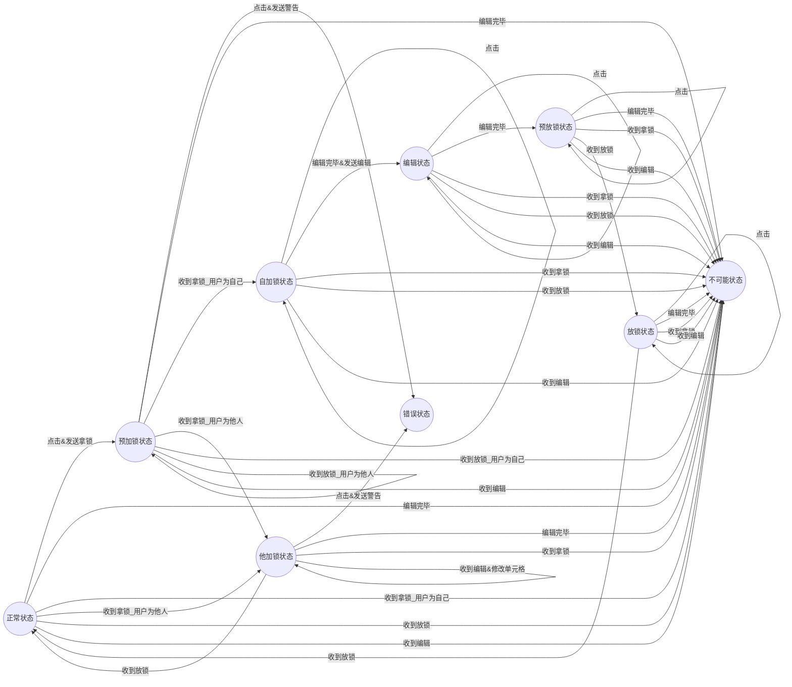

# 设计报告

## 整体框架

​		网页前端+分布式后端+DFS

## 前端

​		前端主要负责后端数据的渲染，以及不同用户间的状态同步。前端主要用React编写，整体风格与腾讯文档类似，分为登录/注册界面，主界面和文档界面。Sheet部分的实现使用了LuckySheet提供的原型，但考虑到特殊的编辑需求，未使用官方提供的协同编辑功能，而是通过Hook函数实现了一套自己的编辑逻辑。

### 技术栈

​		React.js + WebSocket + LuckySheet.

### 网页架构

​		用户可以在登陆界面输入用户名和密码或者在注册界面输入用户名、密码和邮箱获取新账号来进入网站，在主页面中会按访问时间从新到旧展示用户拥有的或者被分享的文档。用户可以删除自己创建的文档，也可以在回收站中看到这些被删除的文档并选择恢复文档。当用户点击文档条目后会跳转到文档编辑界面，可以在此处编辑文档。若用户希望分享文档给其它用户，可以复制当前URL，其他用户可以通过此URL加入编辑。在文档界面中可以看到文件编辑的历史记录(Log)，也可以看到文档的恢复点（Checkpoint，由系统自动保存或者用户手动保存），用户可以选择恢复到某一个恢复点。

### 协同编辑状态机

​		前端实现协同编辑状态时需要同步如文档内容和锁等信息，对于某个单元格的状态，可用状态机的方式表示：

​		状态有：正常状态，自加锁状态，他加锁状态，编辑状态，预放锁状态，放锁状态

​		被动动作有：点击，编辑完毕，收到拿锁，收到放锁，收到编辑

​		主动状态有：修改单元格，发送拿锁，发送放锁，发送编辑，发送警告

​		错误状态并不会停止整个前端，而是会给用户以提示信息。

### Log和Checkpoint实现

