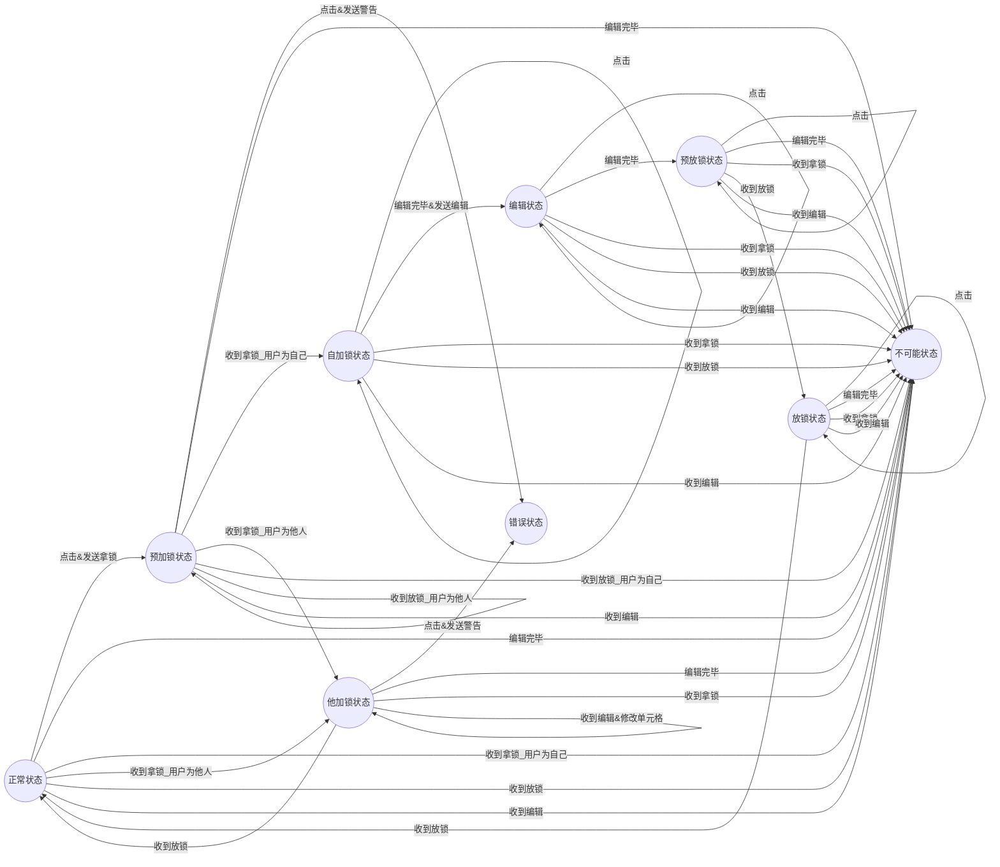

# gDocs设计报告

<p align="right">SSFD小组</p>

[TOC]

## 整体框架

​		网页前端 + 分布式后端 + DFS + ZooKeeper

## 前端

​		前端主要负责后端数据的渲染，以及不同用户间协同编辑时的状态同步。前端主要用React编写，利用了部分Antd的组件库，整体风格与**腾讯文档**类似，分为登录/注册界面，主界面和文档界面。Sheet部分的实现使用了LuckySheet提供的原型，但考虑到特殊的编辑需求，未使用官方提供的协同编辑功能，而是通过Hook函数和WebSocket等实现了一套自己的协同编辑逻辑。

### 技术栈

- 前端渲染

  - React

  - Antd

- 前后端通信

  - WebSocket (前端状态同步)

  - Http (自动重发)

### 总体架构

		

### 主要功能

- 登陆界面：

  - 用户可以在登陆界面输入用户名和密码或者进入网站。
  - 用户可以点击链接跳转至注册界面。
- 注册界面：

  - 用户可以输入用户名，密码和邮箱来注册账号从而进入网站。
- 主页面：

  - 按访问时间从新到旧展示用户拥有的或者被分享的文档。

  - 用户可以删除自己创建的文档。

  - 用户可以在回收站中看到这些被删除的文档并选择恢复文档。

  - 用户可以点击文档条目后会跳转到对应文档的编辑界面。
- 文档界面：
  - 用户可以在此处编辑文档。
  - 若用户希望分享文档给其它用户，可以复制当前URL，其他用户可以通过此URL加入，进行协同编辑。
  - 在文档界面中可以看到文件编辑的历史记录(Log)，也可以看到文档的恢复点（Checkpoint，由系统自动保存或者用户手动保存）。
  - 用户可以选择恢复到某一个恢复点，并点击恢复来保存此次恢复。
  - 用户可以插入图片。
  - 用户可以上传文件。

### 具体实现

#### HTTP请求自动迁移

​		对于正常的HTTP请求，我们给予了其一个时间上限（暂定10000ms），若在规定时间内，后端无响应，则会自动切换端口重新尝试请求，此后的请求会一直沿用这个端口，直到此端口的后端出现无响应等问题。

#### 协同编辑状态机

​		前端实现协同编辑状态时需要同步如文档内容和锁等信息，对于某个单元格的状态，可用状态机的方式表示：

​		状态有：正常状态，自加锁状态，他加锁状态，编辑状态，预放锁状态，放锁状态。

​		被动动作有：点击，编辑完毕，收到拿锁，收到放锁，收到编辑。

​		主动状态有：修改单元格，发送拿锁，发送放锁，发送编辑，发送警告。



​		错误状态并不会停止整个前端，而是会给用户以提示信息。

​		当然光依靠前端是不可能在实现最优情况下的顺序一致性，对于这部分的描述详见后端文档。

## 后端

​		后端主要负责和前端

### 技术栈

1. 分布式缓存
   * 一致性哈希
   * ZooKeeper集群
   * 并发缓存池，LRU Eviction
   * Log & Checkpoint
   * FSCheck
   * 单点登录（JWT）
   * HTTP自动重定向

2. 高吞吐WebSocket
   * 协程池
   * 消息队列
   * Lock-free

### 总体架构


#### 后端服务器

后端服务器使用Go语言编写，以Iris为Web服务器框架。

##### 特点

1. 高可拓展性：通过一致性哈希，服务器可动态增加删除
2. 高可用性：
   * 使用Log和Checkpoint，并有详细分析过的FSCheck机制，具有较强的崩溃一致性
   * 无状态服务器，任务可迁移
3. 高性能：
   * 使用基于LRU驱逐机制的缓存池，减少DFS读写
   * 使用虚拟节点的一致性哈希，负载均衡

##### 主要功能

1. 响应前端请求
   * 登陆、注册
   * 文件权限管理
   * 文件版本管理
   * 文件回收站
   * Websocket实时编辑
   * 大文件上传与下载

2. 与DFS交互
   * 缓存固定大小的文件
   * 持久化日志，主动或被动持久化快照

#### Zookeeper集群

##### 主要功能

1. 服务发现
2. 心跳管理
3. 分布式锁

#### Mysql服务器

##### 主要功能

1. 存储用户信息
2. 存储回收站信息

### 具体实现

#### 服务器动态增删

##### 如何实现服务的分布式

分布式主要是通过JWT单点登录和HTTP 300状态码自动重定向完成的。

[Code Snippet 1](#code1)

前端随机向预设的后端发送请求，后端判断该资源是否在我这里，如果是则处理请求；否则将请求重定向到正确的后端进行处理。

所有后端共享同一私钥，使用JWT作为Token，这样用户在某个服务器上登陆后重定向到其他服务器之后原先的Token依然可以继续使用。

在这个过程中，所有后端的地位是**等价**的，即不存在专门用来提供访问接口的服务器。这样的设计主要是为了避免接口服务器单点故障导致全局故障。转发每一个都可以负责，这样任意后端的崩溃不会造成服务失效，保证系统的可用性。

##### 一致性哈希

###### ZooKeeper的心跳和服务发现功能

一致性哈希借助了ZooKeeper进行实现。

利用ZooKeeper中的*ChildrenWatch*获得当前目录下子节点名称，并注册回调事件，当子节点发生改变时触发。值得注意的是，这个注册函数是**一次性**的，也就是说每次回调函数触发时，原先注册的监听事件会被取消，于是需要重新注册。这样会带来新的问题：在回调事件**触发**和**重新注册**之间的事件会被遗漏（据我所知，在GitHub上许多Go语言的ZooKeeper库都有这个问题，它们只是简单地使用for & select在新事件来的时候重新注册）。为了解决这个问题，我们利用了*ChildrenWatch*在注册和获得子节点列表上的原子性。当回调事件触发时，我们不仅仅关注触发事件的节点，而是将重新调用*ChildrenWatch*后获得的新的子节点集合和之前的集合一起进行考虑。这样旧集合和新集合差集是断开连接的服务器，新集合和就集合的差集则是新加入的服务器。

[Code Snippet 2](#code2)

###### “一致的”一致性哈希

利用ZooKeeper提供的心跳功能，每个后端的连接或断开都能在心跳最长事件内被所有后端感知到。这样后端在收到事件时将发生变化的节点从一致性哈希算法中加入或删除，当新的资源请求到来时，所有的后端节点都能将其一致判断为同一个后端，根据是否为自己的来进行重定向。

[Code Snippet 3](#code3)

##### 细节的问题和解决方案

###### 普通HTTP请求的迁移

对于普通的HTTP请求，如果后端崩溃，那么在给定的ZooKeeper心跳时间（我们设置成7s）有些请求还是会被重定向到这个崩溃的服务器，导致短暂的不可用。因为HTTP请求是短连接，这个问题只要过一会就会自动解决。

###### WebSocket长连接的迁移

然而，因为WebSocket需要后端和前端建立长连接，如果之前的用户都连接在一个后端上，此时新增了一个后端，一致性哈希判断这个资源应该由新加入的后端负责；此时有新的用户加入了这个文件的实时编辑，他会连接到新的后端上。这样会导致一个问题：两组用户在不同缓存上编辑同一个文件，他们看到内容是不一致的。

对这个问题，我们的解决方案是：当服务器对一个文件协同编辑提供服务时，需要从ZooKeeper处拿一个分布式锁，当所有用户断开连接时放锁。这样当新节点加入时，如果有新的用户访问一个还没有被迁移的资源，会阻塞在新的资源处，直到原用户都退出了编辑，这个资源才完全转移到新的服务器上。

没有立即转移是出于对原先用户体验的考虑。用户处于正在编辑的状态中，与服务器交互频繁，贸然中断会极大损害用户的编辑体验，并可能导致编辑内容的丢失；而新用户加入只会被暂停短暂的时间，而且因为用户尚未开始编辑，不会造成内容丢失。

#### 缓存池与日志

##### Sheet在内存中的结构

我们组选择的文档类型是表格，表格可以抽象成二维的字符串数组。由于表格可以动态拓展边界，且协同编辑需要并发地写入，再加上我们设计的缓存需要记录表格中字符串总量，这些要求我们实现一个能够线程安全地读写、拓展二维数组和字符串大小变化的数据结构。

对于动态拓展，因为影响到了整个表格，所以需要加一个全局锁；而原子的单元格更新和记录字符长度变化使用了CAS和加法的原子操作来实现，可以看到，如果新的Set在CAS和原子加法中间先执行了原子加法，字符变化也是会被正确记录的，因为新的Set读到的原来单元格内容已经是CAS过的单元格了。

[Code Snippet 4](#code4)

##### LRU

我们为每个后端服务器设置了最大的缓存大小，当缓存不足时，使用LRU算法驱逐缓存，在DFS中形成一个Checkpoint。因为在*CellNet*中我们记录了所有字符数量，在*Cache*中我们根据字符数量(sizeof(Rune))、单元格(sizeof(*string))、行列数(sizeof([]string))等精细地计算了某个表格在占用内存的大小，并更具计算的大小执行缓存驱逐。

[Code Snippet 5](#code5)

我们实现了Least-Recently-Used算法，使用哈希表和双向链表，链表维护最后访问时间的顺序，哈希表快速查询、删除节点。下面是部分实现代码。

[Code Snippet 6](#code6)

##### Log & Checkpoint & FSCheck

###### Log & Checkpoint

每当用户修改表格时，后端都会往DFS中记录一条修改日志。当后端崩溃时，缓存中的信息丢失。当用户继续请求该资源时，会被重定向到新的后端。新的后端发现缓存中没有这个资源的记录，就会从硬盘中加载最新的checkpoint和log进行恢复。因为每次修改都记录了日志，所以一定能恢复到后端崩溃时的缓存状态，数据不会丢失。

当缓存被驱逐到DFS中时，后端会将当前的缓存记录保存成checkpoint存进DFS。这样当后端需要从文件加载到缓存中时不需要从头开始读日志，只需要从最新的checkpoint开始读取即可。

另外，后端保证崩溃一致性的log和checkpoint能够用来满足gdoc在bonus中要求的*version rollback*和*modification log*功能。除了缓存驱逐时的自动checkpoint，用户也可以主动调用*commitsheet*等接口，主动记录版本和回滚到特定版本。

###### FSCheck

除了使用log和checkpoint来保证崩溃一致性之外，后端在从硬盘中加载时还会使用FSCheck来检查目录结构是否为正常，并尝试恢复。由于DFS提供的文件写入、创建的原子性保证，FSCheck一般不考虑文件破坏的情况（在full check模式下我们还是会检查log和checkpoint结构的正确性）。

例如，在一次*commitsheet*或驱逐缓存操作时，后端会在DFS中顺序新建一个log文件和一个checkpoint文件。经过分析，我们在这个操作中采用以下顺序：

```markdown
    1. 在当前log的末尾写commit记录
    2. 创建新的空log文件
    3. 创建checkpoint记录缓存状态
```

下面考虑后端发生崩溃的情况：

* 如果在1前崩溃，等于没有做commit操作。后端会把最新的log末尾写上commit记录，然后重复2、3操作。
* 如果在1、2间崩溃，后端会发现最新的log不是空的而是已经提交的，于是只需要重复2、3两个操作即可。
* 如果在2、3间崩溃，此时会出现checkpoint文件比log文件少两个的情况。我们需要从最新的checkpoint，和比它更新一个的log文件来逐个恢复checkpoint，直到checkpoint数量恰好比log少一个为止。
* 如果在3之后崩溃，所有commit操作都已经完成，直接加载到缓存即可。

[Code Snippet 7](#code7)

###### DFS

我们将log和checkpoint设计成append-only和write-once也是为了兼容DFS的设计。

DFS要求同一个文件只能由write或者append其中一个操作进行写入，如果混用，则可能会出现不一致的情况。

而对于图片等大文件，我们设计为上传后是只读的，所以只需要调用一次write即可，也不会出现write和append混用的情况。

#### 文件实时编辑

##### WebSocket消息设计

###### 单元格顺序一致，可选的严格一致

对于实时编辑，我们需要保证用户视角和日志记录的一致性。出于性能考虑，我们不保证所有操作的严格一致性，只保证**相同单元格的顺序一致性**。即相同单元格上的修改顺序在所有用户看来是一致的，但是不同单元格之间的顺序可能是不一致的。日志记录上也是遵循这样的一致性保障。

*以下的顺序是可能。但无论怎样，用户看到同一单元格的A-B-C/a-b顺序是不变的。*

|      |    用户A    |    用户B    |
| :--: | :---------: | :---------: |
|  T1  | (0, 0, "A") | (1, 1, "a") |
|  T2  | (1, 1, "a") | (1, 1, "b") |
|  T3  | (0, 0, "B") | (0, 0, "A") |
|  T4  | (1, 1, "b") | (0, 0, "B") |
|  T5  | (0, 0, "C") | (0, 0, "C") |

但我们并非不支持所有单元格之间的**严格一致性**保障。所有日志记录时都带上了时间戳，因此当用户在读取修改日志时，可以使用时间戳进行重排序，获得具有时间顺序的严格一致的日志。

###### 架构设计


生产者消费者架构。为了保障单元格的顺序一致，每个处理相同单元格的*handleCell*之间使用go原生buffer size为1的chan数据结构进行同步（类似信号量）。每个*handleCell*会根据消息内容修改缓存、写日志，最后写入*handleNotify*协程的队列中。*handleNotify*是当用户连接时即创建的持久运行的协程，负责读取消息队列中的消息并转发给用户，当用户断开连接时退出。在*handleNotify*监听的消息队列中，保持着同一个单元格有序、多个单元格之间无序的“偏序”关系，这样就保证了实时编辑时用户所见单元格的顺序一致性。

[Code Snippet 8](#code8)

当有新用户在中途加入编辑时，仅仅是一致的修改日志并不足够，还需要当前编辑文件的所有用户都能看到一致的**当前**文件快照。如果简单地返回当前缓存中的文件内容，由于有些*handleCell*可能正在运行，这会导致一些修改在当前用户获取快照时尚未在缓存中生效，而在获取快照后和启动*handleNotify*来处理消息前就发送给了其它的用户，导致当前加入的用户少接收了一个修改，这会导致不一致，所以我们在设计中使用了WaitGroup和RWLock两个同步工具。RWLock负责在有新用户到来时阻塞住该文件所有的message，使得*handleCell*不会处理新的message；WaitGroup负责等待当前文件的所有*handleCell*任务都完成。*handleNotify*不需要被阻塞因为其中的消息都是确定反映到缓存中的。在阻塞、等待操作完成后，此时获取的快照对所有用户都是一致的。创建新的*handleNotify*协程后不再阻塞message，消息处理流程继续进行。

[Code Snippet 9](#code9)

为了防止不同用户编辑同一个单元格，我利用CAS操作设计了一个可重入的锁。使用用户的uid区分锁的所有者。

[Code Snippet 10](#code10)

整个WebSocket实时编辑架构（没有新用户加入时）是完全无锁的，所有同步都利用go的chan数据结构完成。由于go的协程调度可充分利用chan所提供的wait和signal暗示，性能非常高。对消息处理的吞吐量可以达到**2W-3Wop/s**。

##### 协程池

在对架构进行测试时，我发现如果不对消息数量进行限制，协程数量会直接暴涨到上百万的级别。这会造成大量的内存消耗，而且因为我们的消息处理是事件驱动的，如果协程太多，处理事件的协程得到调度的机会就会变得很小，导致整个系统永久阻塞。出于对这种情况的考虑，我使用了协程池对onMessage协程和handleCell协程的数量进行了限制。协程池大小其实对处理性能没有直接影响，但是能够缓存短暂高并发时的请求，提高对高并发的处理能力。

[Code Snippet 11](#code11)

其中handleCell协程池是阻塞的，onMessage协程池是非阻塞的。也就是说，当大量的消息同时到来时，超量的消息会被直接丢弃。因为后端资源有限，这种限制是必要的。

##### 调参

对于不同性能的机器，以及对服务的不同需求，可以对以下几个参数进行调节。

1. 协程池大小：决定了高并发时能够缓存的未处理的请求，但过高会导致协程占用太多内存。
2. 消息队列(chan)的buffer size，越大协程越不容易阻塞，但同样的会占用更多的内存。

### 测试

#### 正确性

##### 缓存池单元测试

###### Memsheet

1. 测试了*NewMemSheetFromStringSlice*和*NewMemSheet*经过几轮Set后各个单元格内容是否一致。
2. 测试了写入大量随机字符后，*GetSize*返回的大小是否和字符串大小基本相等。
3. 测试了1000并发同时写同一个单元格表格字符数统计是否正确，内容修改是否正确。

###### SheetCache

1. 测试写入三倍于缓存容量时是否按照LRU顺序驱逐缓存
2. 测试Get一个MemSheet后，改变大小为原来4倍，重新Put后是否会驱逐出3个缓存
3. 测试被Get但没有被Put的MemSheet是否没有被驱逐
4. 测试大到缓存无法驱逐来获得足够内存的MemSheet是否会被直接驱逐
5. 测试原先驱逐的MemSheet剩下的空间是否能够继续容纳新的缓存

###### 结果

通过率：100%
覆盖率：93.5%

有部分分支是为了健壮性添加，理论上不会到达，所以无法全部覆盖。

##### LRU单元测试

1. 测试Add方法 - 将新加入或者已有的Key设为最近使用
2. 测试Delete方法 - 删除Key
3. 测试AddToLeastRecent -  将新加入或者已有的Key设为最不常使用，主要是用来恢复DoEvict出的Key
4. 测试DoEvict - 获得最不常使用的Key，并删除
5. 测试Len - 是否和LRU中剩余的Key数量相等

###### 结果

通过率：100%
覆盖率：100%

##### DFS封装测试

1. 在原本不存在20个目录下每个目录都新建20个文件，测试是否报错和create返回的fd是否正常
2. 使用Scan测试原本不存在中间目录是否被正确创建，且名字正确
3. 使用Scan测试每个目录下文件是否被正确创建，且名字正确
4. 对前10个文件夹里的所有文件调用Write随机写入并用ReadAll读取，比较是否相同
5. 对后10个文件夹里的所有文件调用Append随机写入并用ReadAll读取，比较是否相同
6. Delete测试根目录，测试所有子目录和文件是否都被删除
7. Close所有fd，测试是否报错

###### 结果

通过率：100%
覆盖率：77.3%

没有覆盖到的基本都是对网络错误的处理，只是简单地返回错误，不需要覆盖。

##### 系统测试

###### User

1. 测试了Login
2. 测试了Register
3. 测试了GetUser
4. 测试了ModifyUser
5. 测试了ModifyUserAuth

###### Sheet

1. 测试了NewSheet
2. 测试了GetSheet
3. 测试了ModifySheet

###### 结果

注：该测试是针对单机版的测试，后改为分布式部署后只能进行端到端测试

通过率：100%
覆盖率：96.7%

##### 端到端测试

注：以下测试由docker-compose分布式部署后，使用go编写脚本进行端到端测试，故没有覆盖率指标。

###### 单元格顺序一致性

1. 测试单个文件实时编辑：启动多个用户，使用websocket对同一个文件进行无限制的随机写，部分用户会从中间加入，最后比较各个用户通过websocket信息还原的表格内容是否一致
2. 测试多个文件实时编辑：启动多个用户，一边新建房间一边在里面进行限制速率的随机写，用户会从中间加入，最后比较各个用户通过websocket信息还原的表格内容是否一致

###### 内存Evict和文件系统加载

1. 启动多文件实时编辑，调大单个表格的行列，并调大测试新建的文件数量，确保超过服务器的缓存大小，测试各个用户还原的表格应该是否一致
2. 把服务器的最大缓存调整为0，这样每次修改都会触发存盘和加载，然后测试单文件实时编辑，测试各个用户还原的表格应该是否一致

###### 新增和删除节点

1. 删除节点：在Chrome中用前端新建一个表格并进入，随便填写几个单元格，保存版本，在NetWork中查看被分配的后端，手动在Docker关闭该后端，等待ZooKeeper心跳时间(7s)后刷新，看是否被分配到新的后端且不同后端重定向到的位置是否一致。然后看新加载的表格内容是否一致，版本回滚是否一致。
2. 新增节点：新建一个表格，在Chrome中找到对应的后端A，在docker将其关闭，重新打开会重定向到新的后端B，此时使用两个用户登陆B并进入实时编辑状态。重新启动被关闭的后端A，此时该资源在任何后端都会被重定向到原先的后端A，在两个用户未断开连接的情况下，ZooKeeper的分布式锁仍然在后端B，此时新的用户进入实时编辑，会被重定向到后端A，且A会阻塞因为无法获取分布式锁。之后退出B上实时编辑两个用户，A会迅速得到锁并恢复实时编辑的服务。
3. FSCheck：新建表格后多次(>10)修改单元格并创建回滚点，然后手动删除所有checkpoint文件，只保留log文件，将原先负责该资源的服务器在Docker中关闭，重新加载时会触发FSCheck，如果正确的话所有丢失的checkpoint文件都会被恢复，且表格内容和原来一致。

###### 结果

除了缓存为0的无限制单文件测试和多文件测试外，其他的测试都通过，但这两个测试没通过的原因不是因为实现的错误。

在缓存为0的无限制单文件测试中，因为文件写非常慢，而请求不受限制的话会有很多任务堆积在协程池中等待处理，这样导致在测试过程中只处理了几百个请求，而在协程池中还有上万个请求等待处理，这样用户接收到的内容很有可能是服务器还没有返回，而不是返回错误。在调整了协程池大小，减缓了了请求速度，加大了测试等待时间之后，测试是可以通过的。

多文件测试也是同样的原因，服务器负载过高，测试等待结束后还没有处理完，所以需要减慢消息速率，延长等待时间，这样也能通过测试。

#### 性能

##### 单文件实时编辑

在缓存充足的情况下，我们测试了十个用户对单文件无限制随机写5分钟的性能，结果如下：

>concurrency_test.go:37:
>Duration:       300s
>Users:  10
>Total Send:     74250003 op
>Total Recv:     72389638 op
>Send Rate:      24750 op/(s * user)
>Recv Rate:      24129 op/(s * user)
>--- PASS: TestBenchmarkSingleFile (320.26s)

其中Recv Rate是最重要的参数，它是在后端处理完消息之后返回的，代表着后端处理消息的速率；而因为后端会丢弃超过协程池容量的消息，Send Rate和网络关系比较大，而和后端处理能力关系不大。所以我们重点关注Recv Rate。

可以看到消息处理和转发的吞吐非常高，这是因为WebSocket的无锁生产者消费者架构的良好设计带来的，同时也是缓存的作用。我将后端的最大缓存设置为0，这样每次修改都需要读写文件系统，在这样的条件下测试结果如下：

>concurrency_test.go:37:
>Duration:       300s
>Users:  10
>Total Send:     165382496 op
>Total Recv:     40944 op
>Send Rate:      55127 op/(s * user)
>Recv Rate:      13 op/(s * user)
>--- PASS: TestBenchmarkSingleFile (320.27s)

可以看到Recv吞吐非常低，说明后端每秒钟只能处理十几个请求，只有缓存的两千分之一，缓存的重要性得以体现。

##### 后端个数对性能的影响

后端越多，文件的缓存越大，对实时编辑计算资源的也可以分摊更多。如果我们无限制地模拟用户创建新文件并进行实时编辑，后端越多，性能曲线应该越好。但是由于设备的限制，我们很难进行效果能够明显到体现出计算和缓存分摊的大规模测试，所以只是进行了方案设想，并未进行实际测试。

我们设想的方案如下：

1. 采用二八定律，先创建大量文件，然后将80%的访问概率集中在20%的文件上，记录Cache Miss的概率，测试LRU缓存驱逐策略的影响
2. 在不同后端数量下，分别测试 $10^{1}$~$10^{6}$ 个文件实时编辑的各个文件的吞吐
3. 在不同后端数量下，对测试 $10^{1}$~$10^{6}$ 个文件使用GetSheet，使其加载到缓存中，测试Cache Miss的概率


## ZooKeeper

### 实现功能

#### 心跳 & 服务发现

利用ZooKeeper中容器节点断开连接后自动删除的特性。如果有服务器崩溃，它创建的容器节点就会自动删除；新加入的节点会创建新的容器节点。这样可以通过节点的存在性来实现服务发现和心跳。

利用ZooKeeper中的*ChildrenWatch*获得当前目录下子节点名称，并注册回调事件，当子节点发生改变时触发。值得注意的是，这个注册函数是**一次性**的，也就是说每次回调函数触发时，原先注册的监听事件会被取消，于是需要重新注册。这样会带来新的问题：在回调事件**触发**和**重新注册**之间的事件会被遗漏（据我所知，在GitHub上许多Go语言的ZooKeeper库都有这个问题，它们只是简单地使用for & select在新事件来的时候重新注册）。为了解决这个问题，我们利用了*ChildrenWatch*在注册和获得子节点列表上的原子性。当回调事件触发时，我们不仅仅关注触发事件的节点，而是将重新调用*ChildrenWatch*后获得的新的子节点集合和之前的集合一起进行考虑。这样旧集合和新集合差集是断开连接的服务器，新集合和就集合的差集则是新加入的服务器。

[Code Snippet 1](#code1)

#### 消息队列

消息队列是以一个房间的形式组织的：

* Log Room
  * Log Channel 1
  * Log Channel 2
  * ...

加入Log Room的服务器会收到所有Log Channel里的新消息的回调和新的Log Channel被创建的回调。

该消息队列的实现主要是为了满足DFS中Master日志同步的需求，例如这样的场景：

1. 主Master新建一个房间，新建一个消息队列
2. 主Master往队列中写日志，副Master收到回调在本地同步
3. 主Master决定进行checkpoint，为了避免阻塞，新开一个消息队列进行同步
4. 副Master收到新消息队列的回调，开始监听新的队列
5. 主Master做好checkpoint，删除旧队列中的所有日志

[Code Snippet 2](#code2)

#### 选举

所有参与选举的服务器在某个节点下创建顺序容器节点，序号最小的被选举为Leader。其它的节点需要监听在这个节点上，当Leader主动Step Down或者崩溃时，最小节点将会易位，新的leader被选举成功。

我们对现有的库进行了封装。

[Code Snippet 3](#code3)

#### 互斥锁

通过创建同一个节点，创建成功的服务器获得锁；放锁时删除该节点。等待锁的服务器会监听事件，当节点被删除时重新竞争创建。

我们对现有的库进行了封装。

[Code Snippet 4](#code4)

### 测试

#### 心跳 & 服务发现

1. 为四个服务器创建回调函数，使用四个Map记录收到的对应节点事件的数量
2. 四个服务器依次注册，每次注册时调用*GetOriginMates*得到的伙伴数量应该和之前注册的服务器数量相同
3. 检查每个服务器收到的*onConn*事件数量是否正确
4. 每个服务器主动断开连接，检查每个服务器收到的*onDisConn*事件数量是否正确

#### 消息队列

1. 创建10个Log Room
2. 为每个Room创建20/5个初始/追加的Channel，测试初始Channel和追加事件是否正确
3. 为每个channel创建5/20个初始/追加的Log，测试初始Log和追加事件是否正确
4. 使用WaitGroup等待预计的事件结束，并设置超时时间，超时则测试失败

#### 选举

1. 生成10个候选者
2. 每个候选者成为Leader后立刻退位
3. 测试是否同时只有一个Leader，且退位后状态是否改变
4. 使用WaitGroup等待预计的事件结束，并设置超时时间，超时则测试失败

#### 互斥锁

1. 生成10个锁的竞争者
2. 每个竞争者竞争到锁后睡眠一段时间再放锁
3. 测试释放锁的一定是得到锁的
4. 拿到锁时给计数加1，放锁时减1
5. 测试最后计数是否为0

#### 测试结果

通过率：100%
覆盖率：72.6%

未覆盖的大多数都是为了健壮性添加的错误处理，只是简单地返回错误，不需要覆盖。

### 附录

#### 代码节选

##### Code Snippet 1

<div id="code1"></div>

```go
for {
    select {
    case event := <-evenChan:
        if event.Type == zk.EventNodeChildrenChanged {
            newChildren, _, evenChan, err = conn.ChildrenW(path)
            oldSet := mapset.NewSetFromSlice(stringSlice2InterfaceSlice(oldChildren))
            newSet := mapset.NewSetFromSlice(stringSlice2InterfaceSlice(newChildren))
            deleted := oldSet.Difference(newSet)    // old - new = deleted
            added := newSet.Difference(oldSet)      // new - old = added

            for del := range deleted.Iterator().C {
                go onDisConnectCallback(regData, del.(string))
            }
            for add := range added.Iterator().C {
                go onConnectCallback(regData, add.(string))
            }

            oldChildren = newChildren

            newSet.Remove(regData)
            mates = interfaceSlice2StringSlice(newSet.ToSlice())
        }
    case <-closeChan:
        return
    }
}
```

##### Code Snippet 2

<div id="code2"></div>

```go
for {
    select {
    case event := <-evenChan:
        if event.Type == zk.EventNodeChildrenChanged {
            curLogNames, _, evenChan, err = conn.ChildrenW(path)
            if err == zk.ErrNoNode {
                return
            }
            curLidSet := mapset.NewSetFromSlice(stringSlice2InterfaceSlice(curLogNames))
            newLogs := curLidSet.Difference(retLog.lidSet)
            for newLog := range newLogs.Iterator().C {
                logName := newLog.(string)
                logPath := path + "/" + logName
                retLog.lidSet.Add(logName)
                for {
                    if content, _, err := conn.Get(logPath); err == nil {
                        onAppendCallback(LogNode{
                            Lid:     name2id("log", logName),
                            Content: string(content),
                        })
                        break
                    } else {
                        continue
                    }
                }
            }
        }
    case <-stopChan:
        return
    }
}
```

#### Code Snippet 3

<div id="code3"></div>

```go
for {
    select {
        case status, ok := <-election.Status():
            if ok {
                if status.Err != nil {
                    elector.IsLeader = false
                    elector.IsRunning = false
                    return
                } else if status.Role == leaderelection.Leader {
                    elector.IsLeader = true
                    onElectedCallback(&elector)
                }
            }
        }
    }
}
```


#### Code Snippet 4

<div id="code4"></div>

```go
type Mutex struct {
    lock    *zk.Lock

    Name    string
}

func NewMutex(lockName string) (*Mutex, error) {
    if strings.ContainsRune(lockName, '/') {
        return nil, errors.WithStack(BackSlashErr)
    }

    conn, _, err := zk.Connect(hosts, sessionTimeout)
    if err != nil {
        return nil, errors.WithStack(err)
    }

    println(pathWithChroot(lockRoot+"/"+lockName))
    return &Mutex{
        lock: zk.NewLock(conn, pathWithChroot(lockRoot+"/"+lockName), zk.WorldACL(zk.PermAll)),
        Name: lockName,
    }, nil
}

func (l *Mutex) Lock() error {
    return l.lock.Lock()
}

func (l *Mutex) Unlock() error {
    return l.lock.Unlock()
}
```

### 附录

#### 接口

```go
// user
root.Handle("POST", "/login", controller.Login)
root.Handle("POST", "/register", controller.Register)
root.Handle("POST", "/getuser", controller.GetUser)
root.Handle("POST", "/modifyuser", controller.ModifyUser)
root.Handle("POST", "/modifyuserauth", controller.ModifyUserAuth)

// sheet
root.Handle("POST", "/newsheet", controller.NewSheet)
root.Handle("POST", "/getsheet", controller.GetSheet)
root.Handle("POST", "/deletesheet", controller.DeleteSheet)
root.Handle("POST", "/recoversheet", controller.RecoverSheet)
root.Handle("POST", "/commitsheet", controller.CommitSheet)
root.Handle("POST", "/getsheetchkp", controller.GetSheetCheckPoint)
root.Handle("POST", "/getsheetlog", controller.GetSheetLog)
root.Handle("POST", "/rollbacksheet", controller.RollbackSheet)

// sheet websocket
root.Handle("GET", "/sheetws",
controller.SheetBeforeUpgradeHandler(), controller.SheetUpgradeHandler())

// big file
root.Handle("GET", "/getchunk", controller.GetChunk)
root.Handle("POST", "/uploadchunk", controller.UploadChunk)
root.Handle("POST", "/getallchunks", controller.GetAllChunks)

// for debug
p := pprof.New()
root.Handle("GET", "/pprof", p)
root.Handle("GET", "/pprof/{action:path}", p)
```

#### 代码节选

##### Code Snippet 1

<div id="code1"></div>

```go
// Redirect to specific location with Http code 307
func RequestRedirectTo(ctx iris.Context, protocol string, addr string, api string) {
    ctx.Header("Location", protocol + addr + api)
    ctx.StopWithStatus(iris.StatusTemporaryRedirect)
}
```

##### Code Snippet 2

<div id="code2"></div>

```go
for {
    select {
    case event := <-evenChan:
        if event.Type == zk.EventNodeChildrenChanged {
            newChildren, _, evenChan, err = conn.ChildrenW(path)
            oldSet := mapset.NewSetFromSlice(stringSlice2InterfaceSlice(oldChildren))
            newSet := mapset.NewSetFromSlice(stringSlice2InterfaceSlice(newChildren))
            deleted := oldSet.Difference(newSet)    // old - new = deleted
            added := newSet.Difference(oldSet)      // new - old = added

            for del := range deleted.Iterator().C {
                go onDisConnectCallback(regData, del.(string))
            }
            for add := range added.Iterator().C {
                go onConnectCallback(regData, add.(string))
            }

            oldChildren = newChildren

            newSet.Remove(regData)
            mates = interfaceSlice2StringSlice(newSet.ToSlice())
        }
    case <-closeChan:
        return
    }
}
```

##### Code Snippet 3

<div id="code3"></div>

```go
func onHeartbeatConn(_ string, who string) {
    addr, num := unMarshalHashName(who)

    for i := 0; i < num; i += 1 {
        consistentHash.Add(marshalHashName(addr, i))
    }
}

func onHeartbeatDisConn(_ string, who string) {
    addr, num := unMarshalHashName(who)

    for i := 0; i < num; i += 1 {
        consistentHash.Remove(marshalHashName(addr, i))
    }
}

func FileBelongsTo(filename string, fid uint) (addr string, isMine bool) {
    addrRaw, err := consistentHash.Get(filename + strconv.FormatUint(uint64(fid), 10))
    if err != nil {
        panic(err)
    }

    addr, _ = unMarshalHashName(addrRaw)
    isMine = addr == myAddr

    return addr, isMine
}
```

##### Code Snippet 4

<div id="code4"></div>

```go
func (net *CellNet) Set(row int32, col int32, content string) {
    // dynamically expand cells, which need global lock here
    // because all rows and cols would be effected when doing expanding
    net.gLock.Lock()
    if col + 1 > net.maxCol {
        for i := int32(0); i < net.maxRow; i += 1 {
            curRow := &net.cells[i]
            toExtendN := col + 1 - int32(len(*curRow))
            *curRow = append(*curRow, make([]*string, toExtendN)...)
        }
        net.maxCol = col + 1
    }
    if row + 1 > net.maxRow {
        toExtendN := row + 1 - net.maxRow
        toExtend := make([][]*string, toExtendN)
        for i := int32(0); i < toExtendN; i += 1 {
            toExtend[i] = make([]*string, net.maxCol)
        }
        net.cells = append(net.cells, toExtend...)
        net.maxRow = row + 1
    }
    net.gLock.Unlock()

    // add RuneNum and store new string atomically
    for {
        curCell := (*string)(atomic.LoadPointer((*unsafe.Pointer)(unsafe.Pointer(&net.cells[row][col]))))
        if swapped := atomic.CompareAndSwapPointer(
            (*unsafe.Pointer)(unsafe.Pointer(&net.cells[row][col])),
            unsafe.Pointer(curCell),
            unsafe.Pointer(&content)); swapped {
            // interrupt here from another set is safe
            if curCell == nil {
                atomic.AddInt64(&net.RuneNum, int64(len(content)))
            } else {
                atomic.AddInt64(&net.RuneNum, int64(len(content)) - int64(len(*curCell)))
            }
            break
        } else {
            continue
        }
    }
}
```

##### Code Snippet 5

<div id="code5"></div>

```go
func (ms *MemSheet) GetSize() int64 {
    size := int64(unsafe.Sizeof(ms.cells.cells))    // sizeof(CellNet)
    size += int64(ms.cells.maxRow * int32(unsafe.Sizeof(ms.cells.cells[0])))    // sizeof([]string)
    size += int64(ms.cells.maxRow * ms.cells.maxCol * int32(unsafe.Sizeof(ms.cells.cells[0][0])))   // sizeof([][]string)
    size += ms.cells.RuneNum * int64(unsafe.Sizeof('0'))    // sizeof(Rune)
    return size
}
```

##### Code Snippet 6

<div id="code6"></div>

```go
type LRU struct {
    lock            sync.Mutex
    hashMap         map[interface{}]*list.Element
    cacheList       *list.List
}

func (lru *LRU) Add(item interface{}) {
    lru.lock.Lock()
    defer lru.lock.Unlock()

    if elem := lru.hashMap[item]; elem == nil {
        elem = lru.cacheList.PushFront(item)
        lru.hashMap[item] = elem
    } else {
        lru.cacheList.MoveToFront(elem)
    }
}

func (lru *LRU) DoEvict() (item interface{}) {
    lru.lock.Lock()
    defer lru.lock.Unlock()

    evict := lru.cacheList.Back()
    lru.cacheList.Remove(evict)
    item = evict.Value
    delete(lru.hashMap, item)

    return item
}
```

##### Code Snippet 7

<div id="code7"></div>


```go
// SheetFSCheck checks the consistency of sheet filesystem (fullChk: THOROUGHLY, !fullChk: BRIEFLY)
//   and make best efforts to recover it.
// A file used to be handled by a crashed server should be checked THOROUGHLY, otherwise use SheetBriefFSCheck instead.
// If the sheet filesystem is consistent, which means -- (lid == cid + 1) && (log end with commit entry),
//   current maximum cid and lid are returned.
// Or if the sheet filesystem is inconsistent and cannot not be recovered, error SheetFSUnrecoverableErr is returned.
func SheetFSCheck(fid uint, fullChk bool) (cid uint, lid uint, err error)
```

##### Code Snippet 8

<div id="code8"></div>

```go
func handleCell(wss *wsWrap.WSServer, meta *sheetWSMetaEntry, cellMeta *sheetWSCellMetaEntry,
    cellMsg *cellChanMarshal) {
    /* 1. acquire semaphore */
    <- cellMeta.workerSema

    /* 3. wg.Done and release semephore at last */
    defer func () {
        cellMeta.workerSema <- 1
        meta.cellWg.Done()
    }()

    /* 2. handle the message, acquire, modify or release */
    switch cellMsg.MsgCode {
    case MsgAcquire:
        doSheetAcquire(meta, cellMeta, cellMsg)
    case MsgModify:
        doSheetModify(meta, cellMeta, cellMsg)
    case MsgRelease:
        doSheetRelease(meta, cellMeta, cellMsg)
    default:
        logger.Errorf("![fid(%d)\trow(%d)\tcol(%d)] handleCell: Unknown MsgType!",
            meta.fid, row, col)
    }
    return
}

func handleNotify(wss *wsWrap.WSServer, meta *sheetWSMetaEntry, userMeta *sheetWSUserMetaEntry) {
    notifyChan, stopChan := &userMeta.notifyChan, &userMeta.stopChan
    for {
        select {
        case rawMsg := <- *notifyChan:
            id := utils.GenID("sheet", userMeta.uid, userMeta.username, meta.fid)
            wss.Send(id, rawMsg)
        case <- *stopChan:
            return
        }
    }
}
```

##### Code Snippet 9

<div id="code9"></div>

```go
func SheetOnMessage(wss *wsWrap.WSServer, uid uint, username string, fid uint, body []byte) {
    if v, ok := sheetWSMeta.Load(fid); !ok {
        return
    } else {
        meta := v.(*sheetWSMetaEntry)

        /* 1. RLock here, new messages would block when meta.wait() is called until meta.leave() */
        meta.gLock.RLock()
        defer meta.gLock.RUnlock()

        sheetMsg := sheetMessage{}
        if err := json.Unmarshal(body, &sheetMsg); err != nil {
            return
        }

        /* 2. wg.Add here, cooperating with meta.wait() and meta.leave() */
        meta.cellWg.Add(1)

        /* 3. handleCell semaphore implemented with [chan int] */
        cellMeta.workerSema <- 1

        /* 4. add handleCell to goroutine pool */
        handleCellPool.Invoke(handleCellArgs{
            wss: wss,
            meta: meta,
            cellMeta: cellMeta,
            cellMsg: cellMsg,
        })
    }
}

func SheetOnConn(wss *wsWrap.WSServer, uid uint, username string, fid uint) {
    if v, ok := sheetWSMeta.Load(fid); !ok {
        logger.Errorf("![uid(%d)\tusername(%s)\tfid(%d)] No sheetWSMetaEntry on connection!", uid, username, fid)
    } else {
        meta := v.(*sheetWSMetaEntry)

        // meta.wait blocks messages and wait for handleCell to finish
        meta.wait()
        defer meta.leave()

        /* 1. get snapshot from cache */

        /* 2. make a snapshot notify to the user */
        userMeta.notifyChan <- ntfRaw

        // 3. store user metainfo and run handleNotify
        if _, loaded := meta.userMap.LoadOrStore(uid, &userMeta); !loaded {
            go handleNotify(wss, meta, &userMeta)
        } else {
            logger.Errorf("![uid(%d)\tusername(%s)\tfid(%d)] Duplicated connection!", uid, username, fid)
        }
    }
}

func SheetOnDisConn(wss *wsWrap.WSServer, uid uint, username string, fid uint) {
    logger.Infof("[uid(%d)\tusername(%s)\tfid(%d)] Disconnected from server!", uid, username, fid)

    if v, ok := sheetWSMeta.Load(fid); !ok {
        logger.Errorf("![uid(%d)\tusername(%s)\tfid(%d)] No sheetWSMetaEntry on disconnection!", uid, username, fid)
    } else {
        meta := v.(*sheetWSMetaEntry)

        // meta.wait blocks messages and wait for handleCell to finish
        meta.wait()
        defer meta.leave()

        /* 1. release all locks owned by the user and make a release notify */

        /* 2. if no user is editing the file  */
        if curUserN := atomic.AddInt32(&meta.userN, -1); curUserN == 0 {
            // (1) delete group entry
            sheetWSMeta.Delete(fid)

            // (2) unlock zkMutex
            if err := meta.zkMutex.Unlock(); err != nil {
                logger.Errorf("[uid(%d)\tusername(%s)\tfid(%d)] Fail to unlock zkMutex!",uid, username, fid)
            }
        }
    }
}
```

##### Code Snippet 10

<div id="code10"></div>

```go
type cellLock struct {
    owner    uint64
}

func (cl *cellLock) tryLock(uid uint64) (success bool) {
    return atomic.LoadUint64(&cl.owner) == uid 
        || atomic.CompareAndSwapUint64(&cl.owner, 0, uid)
}

func (cl *cellLock) unLock(uid uint64) (success bool) {
    return atomic.CompareAndSwapUint64(&cl.owner, uid, 0)
}
```

##### Code Snippet 11

<div id="code11"></div>

```go
const (
    onMessagePoolSize   =   6000
    handleCellPoolSize  =   10000
)
func init() {
    handleCellPool, _ = ants.NewPoolWithFunc(handleCellPoolSize, handleCellPoolTask, ants.WithNonblocking(false))
    onMessagePool, _ = ants.NewPoolWithFunc(onMessagePoolSize, onMessagePoolTask, ants.WithNonblocking(true))
}
```

